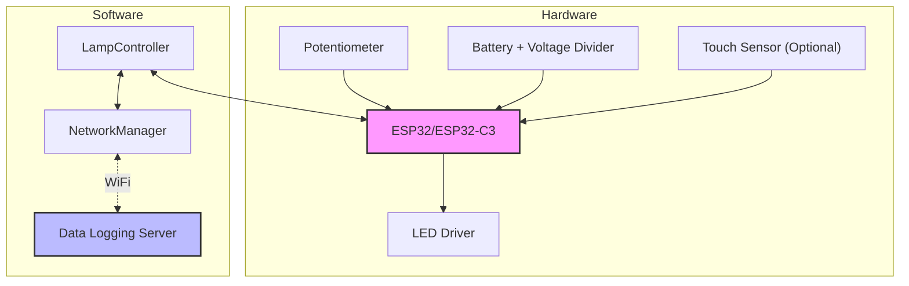
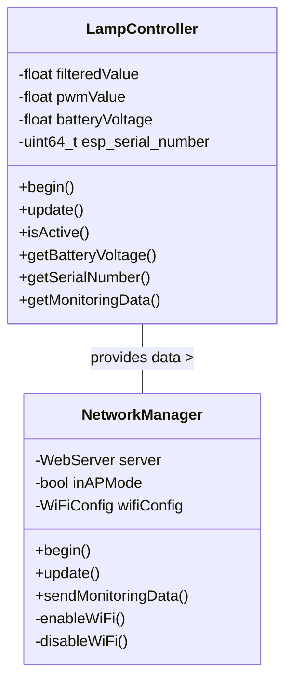
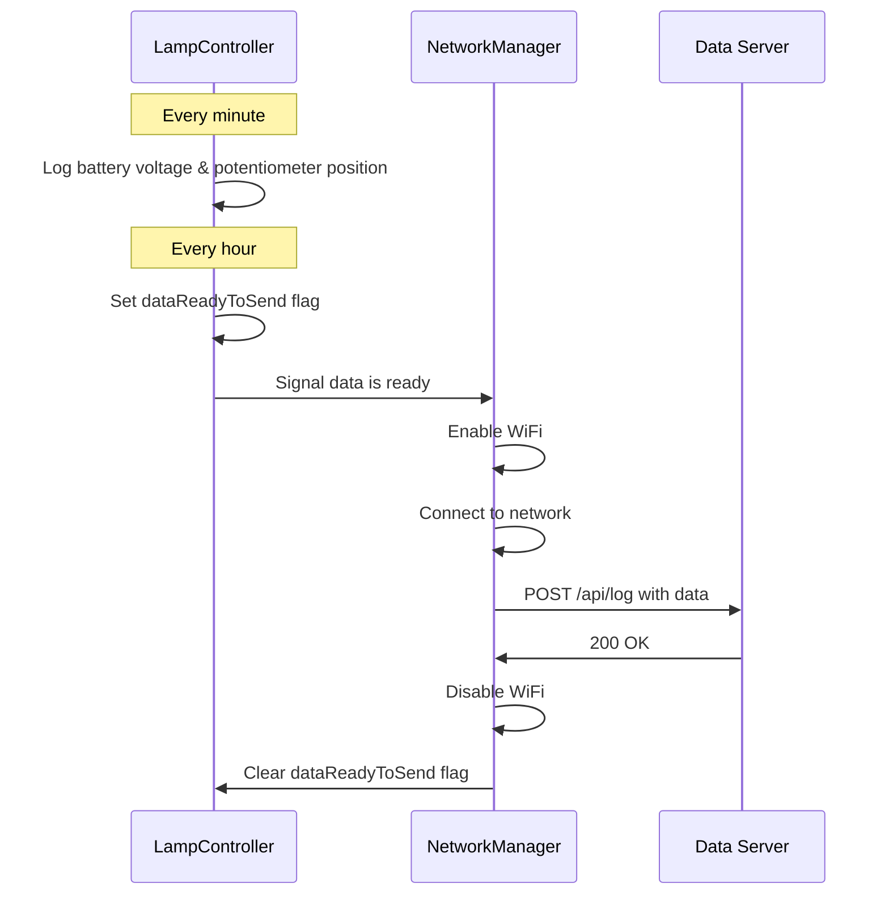
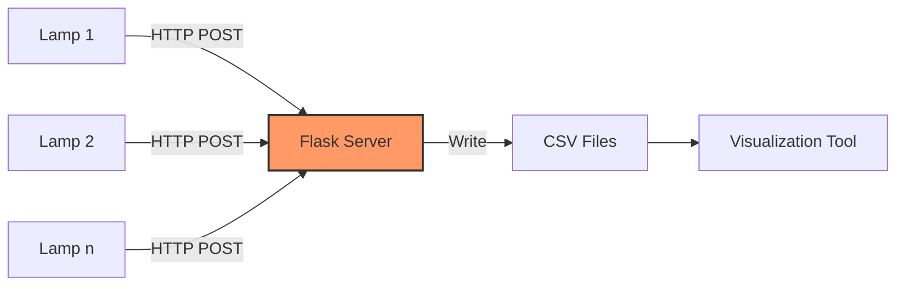
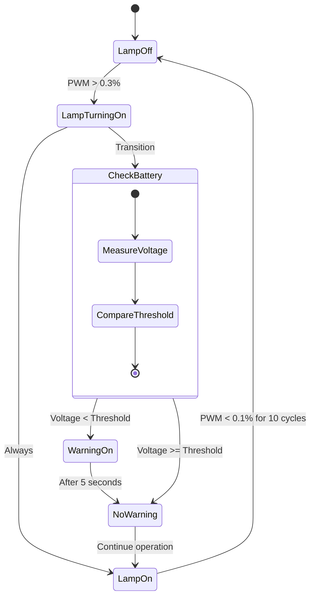

# Smart Lamp Project

## Overview

This project creates an intelligent, battery-powered LED lamp with dimming capabilities, WiFi connectivity, and advanced power management. The lamp features real-time voltage monitoring and supports remote control via a web interface.


## Table of Contents
 
- [System Architecture](#system-architecture)
- [Hardware Components](#hardware-components)
- [Software Structure](#software-structure)
- [Features](#features)
- [Operating Modes](#operating-modes)
- [Battery Monitoring System](#battery-monitoring-system)
- [Power Optimization](#power-optimization)
- [Setup Instructions](#setup-instructions)
- [Usage](#usage)
- [API Reference](#api-reference)
- [Development Guide](#development-guide)
- [Troubleshooting](#troubleshooting)

## System Architecture



## Hardware Components

- **Microcontroller**: ESP32 or ESP32-C3
- **Input**: 
  - Potentiometer for local brightness control
  - Touch sensor (optional) for battery status check
- **Output**: PWM-controlled LED driver
- **Power**: 
  - Battery pack (typically 4 cells)
  - Voltage divider for battery monitoring
- **Connectivity**: WiFi for remote control and data logging

### Pin Configuration

| Component | ESP32 Pin | ESP32-C3 Pin |
|-----------|-----------|--------------|
| Potentiometer | 34 | 0 |
| Voltage Monitoring | 35 | 2 |
| PWM Output | 13 | 10 |
| Status LED | 2 | 8 |
| Touch Sensor | 0 | N/A |

## Software Structure



### Key Classes

- **LampController**: Manages the core lamp functionality, including:
  - Potentiometer reading and filtering
  - PWM generation for LED dimming
  - Battery voltage monitoring
  - Unique device ID management
  - Data collection for logging

- **NetworkManager**: Handles all network-related tasks:
  - WiFi connectivity
  - Web server for remote control
  - Data transmission to logging server
  - Power-efficient WiFi management

## Features

### Local Control
- Smooth logarithmic dimming via potentiometer
- Battery status indication via LED flashes (when touch sensor is activated)
- Low voltage warning LED when battery drops below threshold
- Power-efficient operation with adaptive sleep intervals

### Remote Control
- Web interface for remote brightness control
- Device discovery via mDNS (accessible at smartlamp.local)
- REST API for integration with home automation systems

### Battery Monitoring System
- Periodic logging of battery voltage and potentiometer position
- Power-efficient data collection and transmission
- Historical data visualization

## Operating Modes

The lamp can be configured to operate in various modes by setting feature flags:

1. **Basic Mode** (both flags off)
   - Local control only via potentiometer
   - Maximum battery life
   - No WiFi or network activity

2. **Remote Control Mode** (`REMOTE_CONTROL_ENABLED=true`)
   - Web interface for remote brightness control
   - Standard battery life (WiFi always on)
   - APIs for integration with home automation

3. **Battery Monitoring Mode** (`DATA_LOGGING_ENABLED=true`)
   - Logs battery voltage and usage
   - Extended battery life (WiFi only on when sending data)
   - Periodic data transmission to server

4. **Full-Featured Mode** (both flags on)
   - All features enabled
   - Balanced battery life (WiFi power management)
   - WiFi disabled after extended periods of inactivity

### Development Mode

For easier development and debugging, a development mode is available:

- Set `DEV_MODE=true` in platformio.ini
- Update the hardcoded WiFi credentials in Config.h:
  ```cpp
  static constexpr const char* DEV_WIFI_SSID = "YourSSID";
  static constexpr const char* DEV_WIFI_PASSWORD = "YourPassword";
  ```
- This bypasses the captive portal setup, allowing immediate WiFi connection
- Dedicated environments are available for each use case:
  - `pio run -e local_control -t upload` (Basic Mode)
  - `pio run -e smart_lamp -t upload` (Remote Control Mode)
  - `pio run -e data_logging -t upload` (Battery Monitoring Mode)

## Battery Monitoring System

The system implements a power-efficient approach to battery monitoring:



### Data Collection
- Battery voltage is measured and filtered every update cycle
- Data is logged internally every minute (configurable)
- Transmission to server occurs every hour (configurable)

### Server Architecture
The Python Flask server receives and stores data from all lamps:



## Power Optimization

The project implements several strategies to maximize battery life:

1. **WiFi Power Management**:
   - WiFi is disabled by default
   - Only enabled when data needs to be transmitted
   - Automatically disabled after successful transmission
   - Connection timeout prevents battery drain during connection issues

2. **Operational Efficiency**:
   - Adaptive sleep intervals based on user interaction
   - PWM frequency and resolution optimized for specific ESP32 models
   - Efficient dimming algorithm using exponential mapping

3. **Development Options**:
   - Debug modes can be enabled/disabled at compile time
   - Data logging can be enabled/disabled at compile time

## Setup Instructions

### Hardware Setup

1. Assemble the circuit according to the pin configuration table
2. Connect the battery through a voltage divider to the voltage monitoring pin
3. Connect the potentiometer to the analog input pin
4. Connect the LED driver to the PWM output pin

### Software Setup

#### ESP32 Firmware

1. Clone the repository
2. Install PlatformIO
3. Configure WiFi credentials (if needed)
4. Set your server IP address in `NetworkManager.h`
5. Build and flash the firmware:

```bash
# For ESP32 with debugging
pio run -e esp32dev -t upload

# For ESP32-C3 with power optimization
pio run -e esp32c3 -t upload

# For ESP32-C3 with debugging
pio run -e esp32c3_debug -t upload
```

#### Data Server Setup

1. Install Python 3.6+ and required packages:
```bash
pip install flask pandas matplotlib
```

2. Create the data server file `data_server.py` (see project repository)
3. Run the server:
```bash
python data_server.py
```

4. The server will run on the host machine's IP address (displayed when you start it)
5. Make sure to update `DEFAULT_LOGGING_SERVER_IP` in Config.h with your computer's IP address

#### Visualization Tool

Create a visualization script `visualize_data.py` (see project repository) to plot the collected data.

## Usage

### First-Time Setup

1. Power on the lamp
2. The lamp will create a WiFi access point named "SmartLamp-Setup"
3. Connect to this network and navigate to http://192.168.4.1
4. Enter your WiFi credentials
5. The lamp will restart and connect to your network

### Local Control

- Turn the potentiometer to adjust brightness
- Touch the touch sensor (if supported) when the lamp is off to see battery status:
  - 3 flashes: Battery level good
  - 2 flashes: Battery level medium
  - 1 flash: Battery level low

### Remote Control

1. Find your lamp on the network at http://smartlamp.local
2. Use the web interface to adjust brightness
3. Access status information via the API

### Data Visualization

1. Ensure the data server is running
2. Run the visualization script:
```bash
python visualize_data.py
```
3. Select a device to view its data

## API Reference

### Lamp API Endpoints

| Endpoint | Method | Description |
|----------|--------|-------------|
| `/api/status` | GET | Get lamp status (brightness, battery voltage) |
| `/api/control` | POST | Set brightness level |
| `/api/test` | GET | Test connectivity |

### Data Server API Endpoints

| Endpoint | Method | Description |
|----------|--------|-------------|
| `/api/log` | POST | Log monitoring data |
| `/api/devices` | GET | List all devices that have sent data |

## Development Guide

### Project Structure
```
smartlamp/
├── src/
│ ├── config/
│ │ └── Config.h # Configuration constants
│ ├── lamp/
│ │ ├── LampController.h # Lamp control interface
│ │ └── LampController.cpp # Lamp control implementation
│ ├── network/
│ │ ├── NetworkManager.h # Network interface
│ │ └── NetworkManager.cpp # Network implementation
│ └── main.cpp # Application entry point
├── data_server.py # Data logging server
├── visualize_data.py # Data visualization tool
└── platformio.ini # PlatformIO configuration
```

### Compilation Flags

The project uses several build flags to customize behavior:

- `SERIAL_DEBUG`: Enable/disable serial debugging
- `SUPPORT_TOUCH`: Enable/disable touch sensor functionality
- `DATA_LOGGING_ENABLED`: Enable/disable battery monitoring system
- `REMOTE_CONTROL_ENABLED`: Enable/disable remote control features
- `BOARD_ESP32_DEV`/`BOARD_ESP32_C3`: Target board selection

### Adding New Features

1. **Extend LampController** for new lamp functionality
2. **Extend NetworkManager** for new network functionality
3. **Update Config.h** for new configuration options
4. **Modify main.cpp** for program flow changes

### Power Optimization Tips

- Add `configurePowerSaving()` to setup for additional power savings
- Consider using deep sleep for extended battery life
- Adjust logging and reporting intervals based on battery capacity

## Troubleshooting

### Common Compilation Errors

1. **Missing `uint64_t` type**
   - Error: `'uint64_t' does not name a type`
   - Solution: Add `#include <cstdint>` to the top of LampController.h

2. **WiFi Connection Issues**
   - Verify WiFi credentials are correct
   - Check that the ESP32 is within range of your router
   - Ensure your router supports 2.4GHz networks (ESP32 doesn't support 5GHz)

3. **Data Server Connection Problems**
   - Verify server IP address is set correctly in NetworkManager.h
   - Ensure server is running and accessible from the ESP32's network
   - Check firewall settings to allow connections on port 5000

---

## License

This project is licensed under the MIT License - see the LICENSE file for details.

## Acknowledgments

- ESP32 Arduino Core team
- Flask development team
- All contributors to this project

### Low Battery Warning System

The lamp implements a state machine to efficiently manage the low battery warning LED:



The system works as follows:

1. When the lamp has been off (PWM < 0.1%) for a sufficient period
2. And then turns on (PWM > 0.3%)
3. The system checks the battery voltage
4. If below threshold, it activates the warning LED for 5 seconds
5. The warning only shows when transitioning from off to on, preventing constant warnings

This approach is power-efficient while ensuring users are promptly notified of low battery conditions when they begin using the lamp.